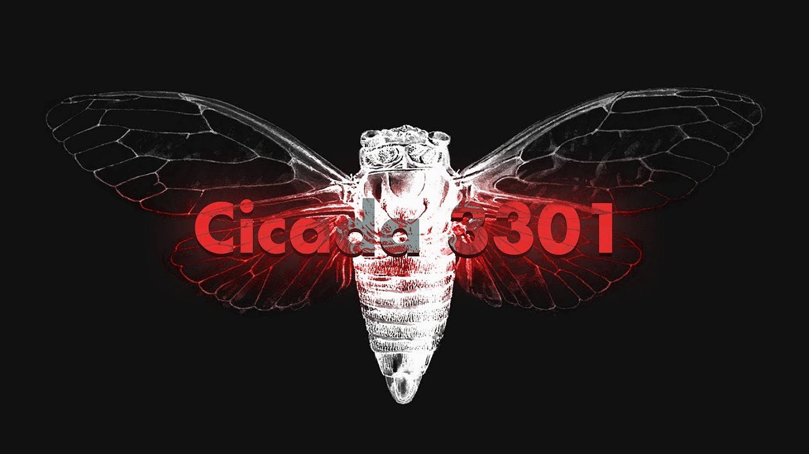

# 🔍 Cicada 3301 Vol1 - TryHackMe Challenge Writeup

<div align="center">



**A Complete Journey Through Cryptography, Steganography, and Digital Forensics**

[](https://tryhackme.com/)
[]()
[]()

*"We have found the individuals we sought"* **- 3301**

</div>

---

## 📋 Table of Contents

- [🎯 Challenge Overview](#-challenge-overview)
- [🛠️ Tools & Techniques](#️-tools--techniques)
- [📂 Repository Structure](#-repository-structure)
- [🎭 Task Walkthroughs](#-task-walkthroughs)
- [🔐 Key Learning Outcomes](#-key-learning-outcomes)
- [🎵 The Journey's End](#-the-journeys-end)
- [📸 Visual Journey](#-visual-journey)
- [🤝 Contributing](#-contributing)

---

## 🎯 Challenge Overview

The **Cicada 3301 Vol1** challenge on TryHackMe is a masterful recreation of the legendary internet puzzle that captivated cryptography enthusiasts worldwide. This repository contains a complete walkthrough of all seven tasks, showcasing advanced techniques in:

- **Audio Steganography** - Hidden QR codes in spectrograms
- **Multi-layer Cryptography** - Base64, Vigenère ciphers, and hash cracking  
- **Image Steganography** - Steghide and OutGuess data extraction
- **Classical Ciphers** - Book cipher with coordinate positioning systems
- **Digital Forensics** - Metadata analysis and file format manipulation

### 🎪 The Cicada 3301 Legacy

Cicada 3301 was a series of puzzles posted on 4chan and other forums starting in 2012, widely regarded as the most elaborate and mysterious puzzle in internet history. The original challenges recruited individuals with exceptional skills in cryptography, steganography, and lateral thinking for an unknown purpose. This TryHackMe room brilliantly captures that essence.

---

## 🛠️ Tools & Techniques

<div align="center">

| Category | Tools Used | Techniques Applied |
|----------|------------|-------------------|
| **Audio Analysis** | Sonic Visualizer | Spectrogram analysis, QR code extraction |
| **Cryptography** | Base64, Vigenère tools, hashid | Multi-layer decryption, hash identification |
| **Steganography** | steghide, OutGuess | Image data extraction, statistical analysis |
| **Hash Cracking** | Online services, hashid | SHA-512 cracking, wordlist alternatives |
| **Classical Ciphers** | Manual decoding | Book cipher, coordinate systems |

</div>

---

## 📂 Repository Structure

```
cicada-3301-vol1/
├── README.md                 # This comprehensive overview
├── tasks/                    # Individual task writeups
│   ├── task1.md             # Download and extraction
│   ├── task2.md             # Audio analysis & QR codes
│   ├── task3.md             # Multi-layer decryption
│   ├── task4.md             # Image steganography
│   ├── task5.md             # OutGuess extraction
│   ├── task6.md             # Hash cracking & book cipher
│   └── task7.md             # The final song
├── imgs/                     # Screenshot documentation
│   ├── t1-s1.png            # Task screenshots
│   ├── t2-s1.png through t2-s3.png
│   ├── ... (complete visual documentation)
│   └── t7-s3.png
└── data/                     # Challenge files
    ├── 3301.wav             # Audio file with hidden QR
    ├── welcome.jpg          # Image with steganographic data
    └── extracted files...   # Various extracted content
```

---

## 🎭 Task Walkthroughs

### 🎬 [Task 1: Download!](tasks/task1.md)
**Objective:** Extract and prepare challenge files
- Simple extraction of two crucial files for the journey ahead
- Foundation setup for all subsequent challenges

### 🎵 [Task 2: Analyze The Audio](tasks/task2.md)
**Objective:** Find the hidden link in audio frequencies
- **Tool:** Sonic Visualizer
- **Technique:** Spectrogram analysis reveals a QR code in frequency domain
- **Discovery:** `https://pastebin.com/wphPq0Aa`

### 🔐 [Task 3: Decode the Passphrase](tasks/task3.md)  
**Objective:** Decrypt multi-layered encryption
- **Layer 1:** Base64 decoding of passphrase and key
- **Layer 2:** Vigenère cipher encryption using "Cicada" as key
- **Final Result:** `Ju5T_4_P455phr453!`

### 🖼️ [Task 4: Gather Metadata](tasks/task4.md)
**Objective:** Extract hidden files from images
- **Tool:** Steghide with AES encryption
- **Achievement:** Successfully extracted `invitation.txt`
- **Discovery:** `https://imgur.com/a/c0ZSZga`

### 🎯 [Task 5: Find Hidden Files](tasks/task5.md)
**Objective:** Apply historical Cicada techniques
- **Tool:** OutGuess (authentic Cicada 3301 methodology)
- **Challenge:** Format conversion and file compatibility
- **Extraction:** 1,351 bytes of PGP-signed content

### 📚 [Task 6: Book Cipher](tasks/task6.md)
**Objective:** Master classical cryptographic techniques
- **Hash Cracking:** SHA-512 to reveal "The Book of Law"
- **Cipher Method:** Coordinate-based book cipher
- **Innovation:** Positive/negative positioning from line numbers
- **Final Link:** `https://bit.ly/39pw2NH`

### 🎼 [Task 7: The Final Song](tasks/task7.md)
**Objective:** Reach the journey's conclusion
- **Destination:** SoundCloud revelation
- **Final Answer:** **"the instar emergence"**
- **Achievement:** Complete puzzle chain solved

---

## 🔐 Key Learning Outcomes

### 🎓 Technical Skills Mastered

- **Audio Forensics:** Converting time-domain audio to frequency-domain visualizations
- **Cryptanalysis:** Multi-stage decryption with modern and classical methods
- **Steganographic Analysis:** Both LSB and statistical steganography techniques
- **Hash Analysis:** Identifying and cracking cryptographic hashes
- **Historical Cryptography:** Applying authentic techniques from famous puzzles

### 🧠 Problem-Solving Approaches

- **Layered Thinking:** Understanding that solutions often require multiple steps
- **Tool Selection:** Choosing appropriate tools for specific cryptographic challenges  
- **Format Awareness:** Recognizing file format requirements and limitations
- **Historical Context:** Applying knowledge of original Cicada 3301 methodologies

### 🔍 Investigative Methodologies

- **Systematic Analysis:** Progressing logically through challenge chains
- **Documentation:** Maintaining detailed records for complex multi-step puzzles
- **Persistence:** Overcoming format issues, tool limitations, and dead ends
- **Creative Problem-Solving:** Thinking beyond conventional approaches

---

## 🎵 The Journey's End

**"the instar emergence"** - The final song title carries deep symbolic meaning. In entomology, an *instar* represents the developmental stage between molts in an insect's metamorphosis. This perfectly encapsulates the transformative journey every solver undergoes through the Cicada challenges - emerging as a more skilled and knowledgeable individual.

The progression from simple file extraction to sophisticated book ciphers mirrors the original Cicada 3301's escalating complexity, designed to test not just technical skills but dedication, creativity, and the ability to think like the puzzle's creators.

---

## 📸 Visual Journey

<div align="center">

### Audio Spectrogram Analysis
*Discovering QR codes hidden in frequency domains*

### Multi-layer Cryptographic Decryption  
*From Base64 to Vigenère cipher mastery*

### Steganographic Extraction
*Revealing secrets within innocent-looking images*

### Historical Cryptography
*Applying classical techniques to modern puzzles*

</div>

---

## 🏆 Achievement Unlocked

```
╔══════════════════════════════════════╗
║          CICADA 3301 VOL1            ║
║           COMPLETED  ✓               ║
║                                      ║
║  "We have found the individuals      ║
║         we sought"                   ║
║                                      ║
║            - 3301                    ║
╚══════════════════════════════════════╝
```

---

## 🤝 Contributing

While this represents a complete solution to the Cicada 3301 Vol1 challenge, contributions are welcome for:

- **Alternative Solutions:** Different approaches to the same problems
- **Tool Improvements:** Scripts or automation for repetitive tasks  
- **Educational Content:** Additional explanations or learning resources
- **Documentation:** Improvements to clarity or completeness

---

## 🔗 References & Resources

- **TryHackMe Platform:** [Cicada 3301 Vol1 Room](https://tryhackme.com/)
- **Original Cicada 3301:** [Wikipedia Article](https://en.wikipedia.org/wiki/Cicada_3301)
- **Sonic Visualizer:** [Official Documentation](https://www.sonicvisualiser.org/)
- **Steganography Tools:** steghide, OutGuess documentation
- **Classical Cryptography:** Historical cipher references and methodologies

---

<div align="center">

**🎭 "Beware false paths. Verify your steps. We are always watching." - 3301**

*This repository serves as both a complete walkthrough and educational resource for understanding the sophisticated puzzle-solving techniques that made Cicada 3301 legendary.*

---

**⭐ If this helped you solve the challenge or learn new techniques, consider starring the repository!**

</div>
