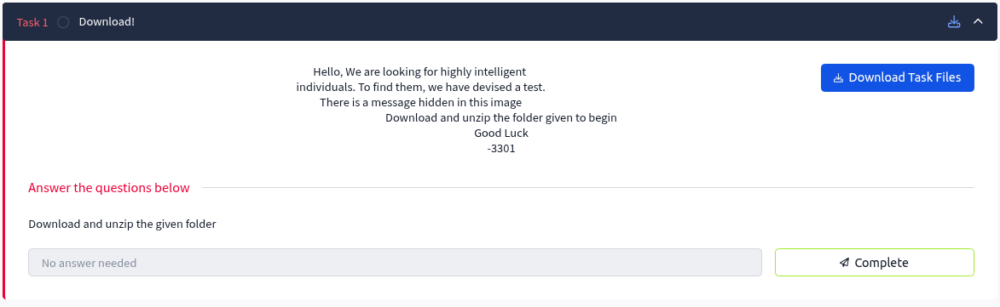

# Task 1: Download!

## Task Description
Download and unzip the given folder

## Objective
- Download the challenge files from TryHackMe
- Extract/unzip the downloaded archive
- Prepare files for analysis in subsequent tasks

## Solution Process

### Step 1: Download the Challenge Files
- Navigate to the TryHackMe Cicada 3301 Vol1 room
- Download the provided zip file containing the challenge materials

### Step 2: Extract the Archive
- Unzip the downloaded file using standard extraction tools
- Verify the contents of the extracted folder

## Files Obtained
After extraction, we obtained 2 files that will be analyzed in the upcoming tasks:
- File 1: [welcome.jpg](../data/welcome.jpg)
- File 2: [3301.wav](../data/3301.wav)

## Tools Used
- Standard file extraction utility (unzip, 7-Zip, WinRAR, etc.)

## Key Notes
- This is a straightforward setup task
- No cryptographic analysis or steganography required
- Files are stored in the `../data/` directory for organization
- These extracted files will be the foundation for all subsequent challenges

## Task Status
✅ **Completed** - Files successfully downloaded and extracted

---
*Next: Proceed to Task 2 for file analysis*
