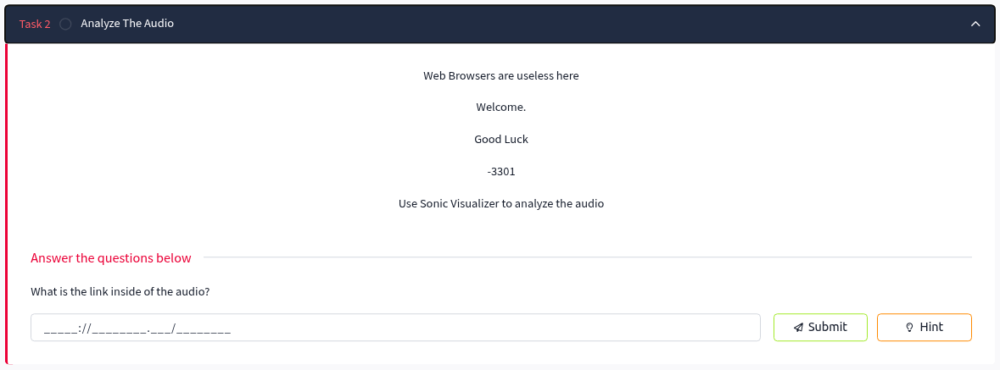
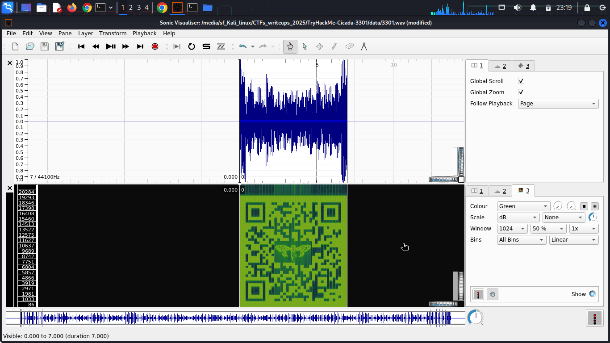

# Task 2: Analyze The Audio

## Task Description
What is the link inside of the audio?



## Given Information
```
Web Browsers are useless here

Welcome.

Good Luck

-3301

Use Sonic Visualizer to analyze the audio
```

## Objective
- Analyze the `3301.wav` file obtained from Task 1
- Extract hidden information from the audio file
- Find the concealed link within the audio

## Solution Process

### Step 1: Open Sonic Visualizer
- Launch Sonic Visualizer audio analysis software
- Load the `3301.wav` file from the `../data/` directory

### Step 2: Initial Analysis
- Initially, only the standard audio waveform is visible
- No obvious hidden content can be seen in the default view

### Step 3: Add Spectrogram Analysis
- Navigate to **Pane → Add Spectrogram**
- The spectrogram reveals frequency-domain information over time
- Hidden visual pattern becomes visible in the spectrogram



### Step 4: Discover the QR Code
- A QR code pattern is clearly visible in the spectrogram display
- The QR code is embedded as frequency patterns in the audio file


### Step 5: Extract the Link
- Scan the QR code using any QR code reader/scanner
- The QR code reveals the hidden link

## Answer
```
https://pastebin.com/wphPq0Aa
```

## Tools Used
- **Sonic Visualizer** - Audio analysis and spectrogram generation
- **QR Code Scanner** - To decode the visual QR pattern

## Key Techniques
- **Spectrogram Analysis** - Converting audio to frequency-domain visualization
- **Steganography** - Hidden data embedded in audio frequencies
- **Visual Pattern Recognition** - Identifying QR codes in spectrograms

## Key Learning Points
- Audio files can contain hidden visual information in their frequency spectrum
- Spectrogram analysis is crucial for audio steganography challenges
- QR codes can be embedded as frequency patterns in audio files
- Always analyze audio files in both time and frequency domains

## Task Status
✅ **Completed** - Link successfully extracted from audio file

---
*Next: Proceed to Task 3 to analyze the discovered Pastebin link*
