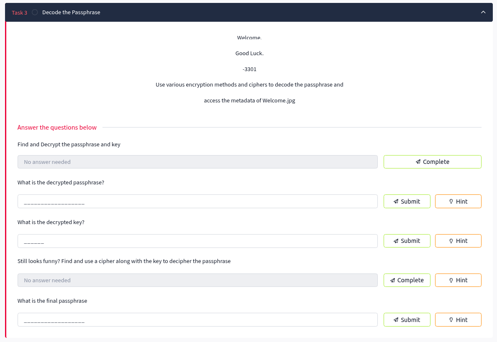
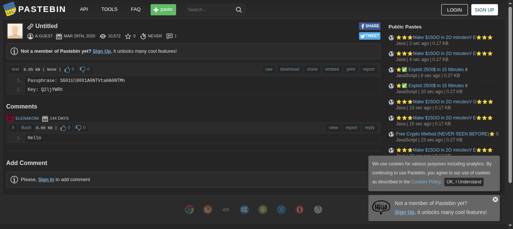
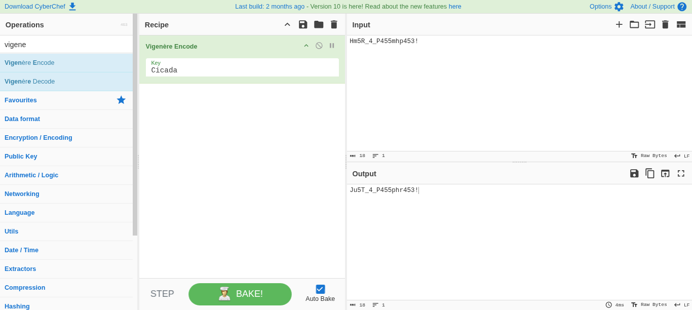

# Task 3: Decode the Passphrase

## Task Description
Welcome.
Good Luck.
-3301

Use various encryption methods and ciphers to decode the passphrase and access the metadata of Welcome.jpg



## Objective
- Decrypt the passphrase and key found in the Pastebin link
- Apply multiple decryption layers to reveal the final passphrase
- Prepare credentials for accessing metadata in Welcome.jpg

## Questions and Solutions

### Question 1: Find and Decrypt the passphrase and key

Following the Pastebin link discovered in Task 2 (`https://pastebin.com/wphPq0Aa`), we find the encoded credentials:



**Found Data:**
```
Passphrase: SG01Ul80X1A0NTVtaHA0NTMh
Key: Q2ljYWRh
```

### Question 2: What is the decrypted passphrase?
**Hint:** Base64

Using Base64 decoding to decrypt the passphrase:

```bash
echo "SG01Ul80X1A0NTVtaHA0NTMh" | base64 -d
```

**Answer:** `Hm5R_4_P455mhp453!`

### Question 3: What is the decrypted key?
**Hint:** Base64

Using Base64 decoding to decrypt the key:

```bash
echo "Q2ljYWRh" | base64 -d
```

**Answer:** `Cicada`

### Question 4: Still looks funny? Find and use a cipher along with the key to decipher the passphrase
**Hint:** French Diplomat Cipher

The hint refers to the **Vigenère cipher**, historically known as the "French Diplomat Cipher."

We need to apply Vigenère encryption using:
- **Plaintext:** `Hm5R_4_P455mhp453!`
- **Key:** `Cicada`

### Question 5: What is the final passphrase?

Using Vigenère cipher with the key "Cicada" to encrypt "Hm5R_4_P455mhp453!":



**Final Answer:** `Ju5T_4_P455phr453!`

## Solution Process Summary

1. **Access Pastebin link** from Task 2
2. **Extract encoded credentials** from the paste
3. **Base64 decode** both passphrase and key
4. **Apply Vigenère cipher** using the decoded key to encrypt the decrypted passphrase
5. **Obtain final passphrase** for metadata extraction

## Tools Used
- **Web Browser** - Access Pastebin link
- **Base64 decoder** - Command line or online tool
- **Vigenère cipher tool** - Online cipher decoder or manual calculation

## Key Techniques
- **Base64 Decoding** - Converting encoded text to readable format
- **Vigenère Cipher** - Classical polyalphabetic substitution cipher
- **Multi-layer Encryption** - Applying multiple encryption methods sequentially

## Encryption Chain
```
Original → Base64 Decode → Vigenère Encrypt → Final Result
SG01Ul80X1A0NTVtaHA0NTMh → Hm5R_4_P455mhp453! → Ju5T_4_P455phr453!
```

## Key Learning Points
- Cicada 3301 challenges often involve multiple encryption layers
- Base64 is commonly used as an initial encoding layer
- Historical cipher names (French Diplomat) refer to classical cryptographic methods
- Always check if decoded text needs further decryption

## Task Status
✅ **Completed** - Final passphrase successfully decrypted: `Ju5T_4_P455phr453!`

---
*Next: Use the passphrase to access Welcome.jpg metadata in Task 4*
