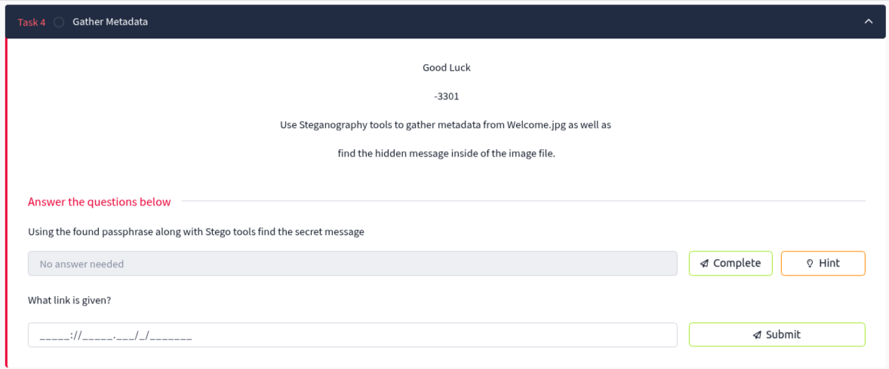
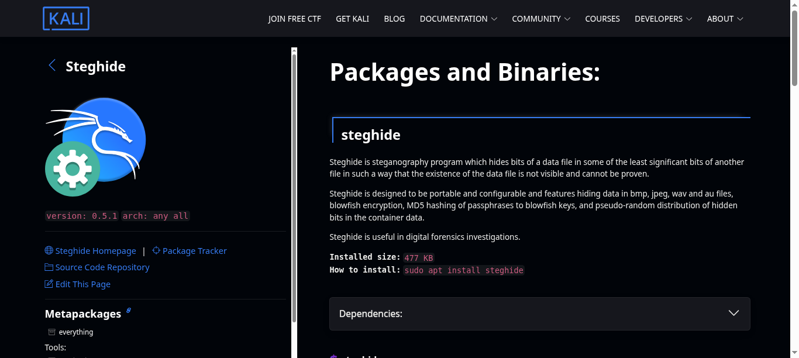

# Task 4: Gather Metadata

## Task Description
```
Good Luck

-3301

Use Steganography tools to gather metadata from Welcome.jpg as well as 

find the hidden message inside of the image file.
```



## Objective
- Use steganography tools to extract hidden data from Welcome.jpg
- Apply the passphrase discovered in Task 3
- Retrieve the secret message embedded within the image file

## Questions and Solutions

### Question 1: Using the found passphrase along with Stego tools find the secret message
**Hint:** Steghide

Using the final passphrase from Task 3: `Ju5T_4_P455phr453!`

#### Step 1: Check for Embedded Data
First, let's examine if there's hidden data in the Welcome.jpg file:

```bash
steghide info welcome.jpg
```

Output:
```
"welcome.jpg":
  format: jpeg
  capacity: 1.5 KB
Try to get information about embedded data ? (y/n) y
Enter passphrase: 
  embedded file "invitation.txt":
    size: 28.0 Byte
    encrypted: rijndael-128, cbc
    compressed: yes
```

This reveals that there's an embedded file called `invitation.txt` hidden inside the image.

#### Step 2: Extract the Hidden File
Extract the embedded data using steghide:

```bash
steghide extract -sf welcome.jpg
Enter passphrase: 
wrote extracted data to "invitation.txt".
```

The passphrase `Ju5T_4_P455phr453!` successfully unlocks the hidden content.

#### Step 3: Read the Secret Message
```bash
cat invitation.txt
```

### Question 2: What link is given?

The extracted invitation.txt file contains:

**Answer:** `https://imgur.com/a/c0ZSZga`

## Tools Used
- **Steghide** - Steganography tool for hiding/extracting data in image files



## Key Techniques
- **Image Steganography** - Hiding data within digital images
- **AES Encryption** - The embedded file uses Rijndael-128 (AES) encryption
- **Password-based Extraction** - Using the discovered passphrase to unlock hidden content

## Solution Process Summary
1. **Use steghide info** to check for embedded data in Welcome.jpg
2. **Confirm embedded file** presence (invitation.txt)
3. **Extract using steghide** with the passphrase from Task 3
4. **Read the extracted file** to find the hidden link

## Technical Details
- **Embedded file:** invitation.txt
- **File size:** 28.0 Bytes
- **Encryption:** Rijndael-128 (AES), CBC mode
- **Compression:** Yes
- **Image capacity:** 1.5 KB

## Key Learning Points
- Steghide is a powerful tool for JPEG/BMP steganography
- Images can contain encrypted and compressed hidden files
- The passphrase from previous challenges serves as the decryption key
- Always check file info before attempting extraction

## Task Status
✅ **Completed** - Secret link successfully extracted: `https://imgur.com/a/c0ZSZga`

---
*Next: Analyze the discovered Imgur link in Task 5*
