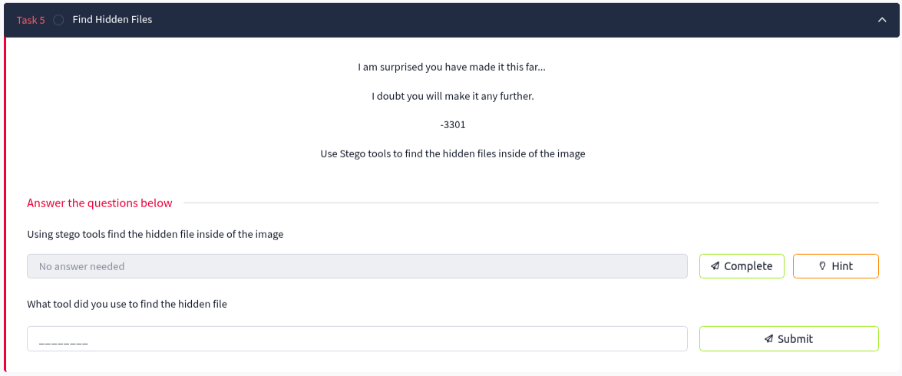
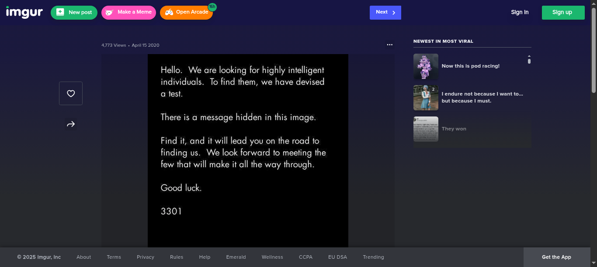
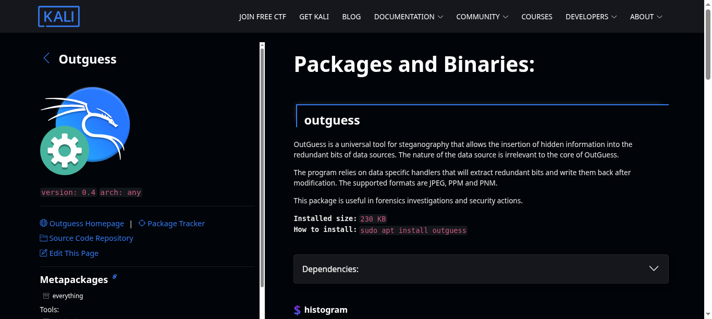

# Task 5: Find Hidden Files

## Task Description
```
I am surprised you have made it this far... 

I doubt you will make it any further.

-3301

Use Stego tools to find the hidden files inside of the image
```



## Objective
- Use steganography tools to find hidden files within the image from the Imgur link
- Apply the tool historically used in the original Cicada 3301 challenges
- Extract the concealed data for further analysis

## Questions and Solutions

### Question 1: Using stego tools find the hidden file inside of the image
**Hint:** Use the same tool used to extract data in the original Cicada challenges

From the hint, we know that the original Cicada 3301 challenges used **OutGuess** for steganography.

#### Step 1: Access the Image
Navigate to the Imgur link discovered in Task 4: `https://imgur.com/a/c0ZSZga`



#### Step 2: Download the Correct Format
- The image is initially in PNG format
- OutGuess requires JPEG format for processing
- Download the JPEG version of the same image from the Imgur gallery
- Rename the file extension from `.jpeg` to `.jpg` for OutGuess compatibility

#### Step 3: Extract Hidden Data with OutGuess
Use OutGuess to extract the hidden data:

```bash
outguess -r 8S8OaQw.jpg out.txt
```

Output:
```
Reading 8S8OaQw.jpg....
Extracting usable bits:   29035 bits
Steg retrieve: seed: 38, len: 1351
```

The extraction was successful, revealing hidden data embedded within the image.

### Question 2: What tool did you use to find the hidden file?

**Answer:** `outguess`

## Tools Used
- **OutGuess** - Statistical steganography tool used in original Cicada 3301 challenges



## Key Techniques
- **Statistical Steganography** - OutGuess uses statistical methods to hide data
- **Format Conversion** - Converting PNG to JPEG for tool compatibility
- **Historical Tool Recognition** - Understanding tools used in original Cicada challenges

## Solution Process Summary
1. **Access Imgur link** from Task 4 results
2. **Identify format requirements** - OutGuess needs JPEG format
3. **Download and rename** the image file appropriately
4. **Execute OutGuess extraction** to retrieve hidden content
5. **Verify successful extraction** with output statistics

## Technical Details
- **Tool:** OutGuess statistical steganography
- **Input file:** 8S8OaQw.jpg
- **Output file:** out.txt
- **Extracted bits:** 29,035 usable bits
- **Seed:** 38
- **Data length:** 1,351 bytes

## Key Learning Points
- OutGuess was the primary steganography tool in original Cicada 3301 puzzles
- File format compatibility is crucial for steganography tools
- Statistical steganography differs from traditional methods like LSB
- Large amounts of data can be hidden within image files

## File Format Notes
- **Original format:** PNG (not supported by OutGuess)
- **Required format:** JPEG (.jpg extension specifically)
- **File naming:** Extension must be .jpg, not .jpeg for OutGuess compatibility

## Task Status
✅ **Completed** - Hidden file successfully extracted using OutGuess

**Extracted Data:** Available in `out.txt` for analysis in Task 6

---
*Next: Analyze the extracted data from out.txt in Task 6*
