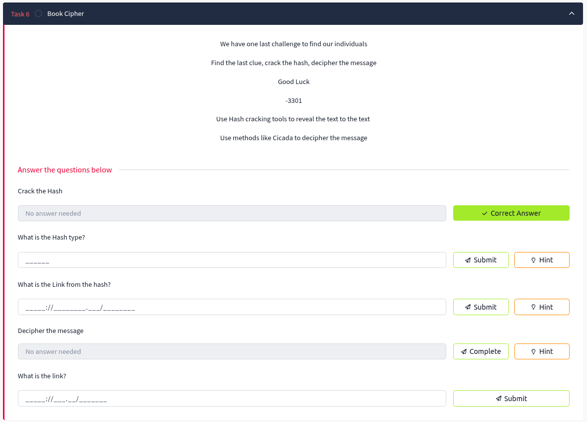
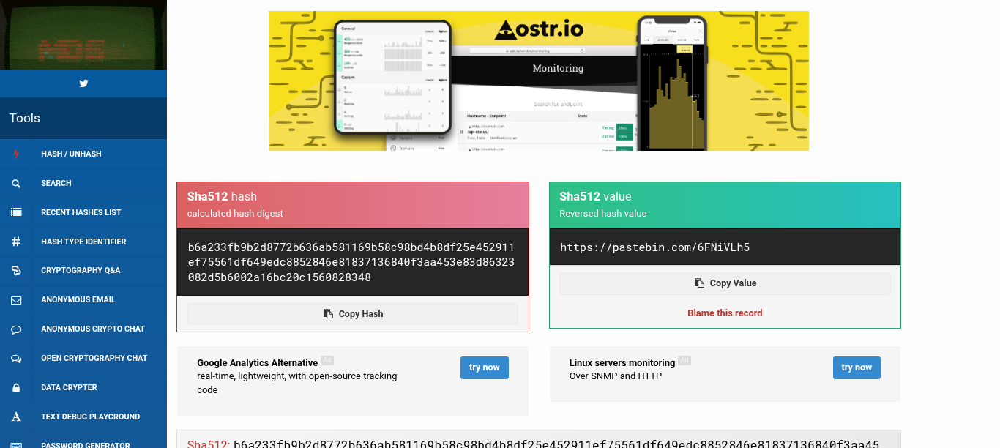
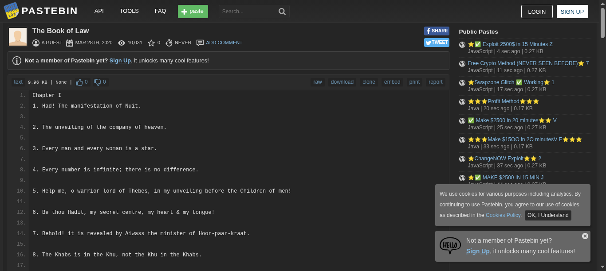

# Task 6: Book Cipher

## Task Description
```
We have one last challenge to find our individuals

Find the last clue, crack the hash, decipher the message

Good Luck

-3301

Use Hash cracking tools to reveal the text to the text 

Use methods like Cicada to decipher the message
```



## Objective
- Crack the hash found in the extracted PGP message
- Identify and use the book for cipher decryption
- Apply book cipher techniques used in original Cicada 3301 challenges
- Decipher the coded message to reveal the final link

## Extracted Data from Task 5
The `out.txt` file contains a PGP-signed message with:
- A hash to crack: `b6a233fb9b2d8772b636ab581169b58c98bd4b8df25e452911ef75561df649edc8852846e81837136840f3aa453e83d86323082d5b6002a16bc20c1560828348`
- Book cipher coordinates in format `I:chapter:line:position`
- Instructions for positive/negative positioning

## Questions and Solutions

### Question 1: Crack the Hash

First, identify the hash type using hashid:

```bash
hashid b6a233fb9b2d8772b636ab581169b58c98bd4b8df25e452911ef75561df649edc8852846e81837136840f3aa453e83d86323082d5b6002a16bc20c1560828348
```

Output:
```
Analyzing 'b6a233fb9b2d8772b636ab581169b58c98bd4b8df25e452911ef75561df649edc8852846e81837136840f3aa453e83d86323082d5b6002a16bc20c1560828348'
[+] SHA-512 
[+] Whirlpool 
[+] Salsa10 
[+] Salsa20 
[+] SHA3-512 
[+] Skein-512 
[+] Skein-1024(512)
```

### Question 2: What is the Hash type?

**Answer:** `SHA-512`

### Question 3: What is the Link from the hash?
**Hint:** Answer is not in conventional wordlists, try an online service

Using the online service at `https://md5hashing.net/hash/sha512`:



**Answer:** `https://pastebin.com/6FNiVLh5`

This link contains "The Book of Law" - the reference text for the book cipher.



### Question 4: Decipher the message
**Hint:** Use the same techniques the Cicada participants used

The book cipher coordinates from the PGP message:
```
Use positive integers to go forward in the text use negative integers to go backwards in the text.

I:1:6
I:2:15
I:3:26
I:5:4 
I:6:15
I:10:26
/
/
I:13:5
I:13:1
I:14:7
I:3:29
I:19:8 
I:22:25
/
I:23:-1
I:19:-1
I:2:21
I:5:9
I:24:-2
I:22:1 
I:38:1
```

**Cipher Format:** `I:chapter:line:position`
- **Positive numbers:** Count forward in the line
- **Negative numbers:** Count backward from the end of the line
- **Forward slashes (/):** Represent spaces in the final message

### Question 5: What is the link?

By applying the book cipher coordinates to "The Book of Law":

1. Extract each letter according to the coordinates
2. Use positive integers to go forward in the text
3. Use negative integers to go backwards in the text
4. Assemble the letters in sequence

**Final Answer:** `https://bit.ly/39pw2NH`

## Tools Used
- **hashid** - Hash type identification
- **MD5Hashing.net** - Online hash cracking service
- **Manual decryption** - Book cipher coordinate extraction

## Key Techniques
- **Hash Identification** - Determining SHA-512 hash type
- **Online Hash Cracking** - Using specialized services for uncommon hashes
- **Book Cipher** - Classical cipher using a reference text
- **Coordinate System** - Chapter:Line:Position format
- **Bidirectional Positioning** - Forward/backward character counting

## Solution Process Summary
1. **Extract PGP message** from Task 5 output
2. **Identify hash type** using hashid tool
3. **Crack SHA-512 hash** using online services
4. **Retrieve reference book** from cracked hash link
5. **Apply book cipher coordinates** to extract characters
6. **Assemble final message** following coordinate sequence

## Technical Details
- **Hash Type:** SHA-512 (128 character length)
- **Reference Book:** The Book of Law by Aleister Crowley
- **Cipher Method:** Classical book cipher with coordinate system
- **Position Logic:** Positive (forward), Negative (backward)

## Key Learning Points
- Not all hashes can be cracked with standard wordlists
- Book ciphers require exact reference texts
- Cicada 3301 used classical cryptographic methods
- Coordinate systems must be followed precisely
- Online services can crack hashes not in standard databases

## Task Status
✅ **Completed** - Final link successfully deciphered: `https://bit.ly/39pw2NH`

---
*Next: Follow the final link to complete the Cicada 3301 Vol1 challenge in Task 7*
