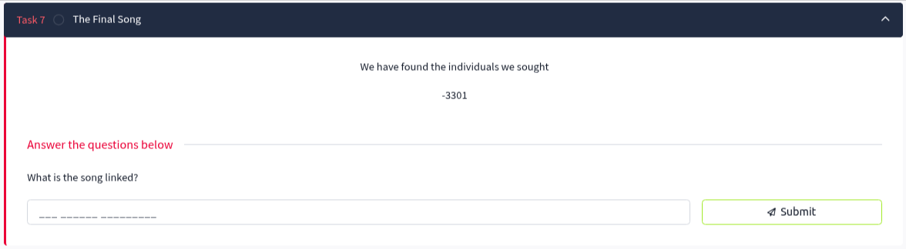
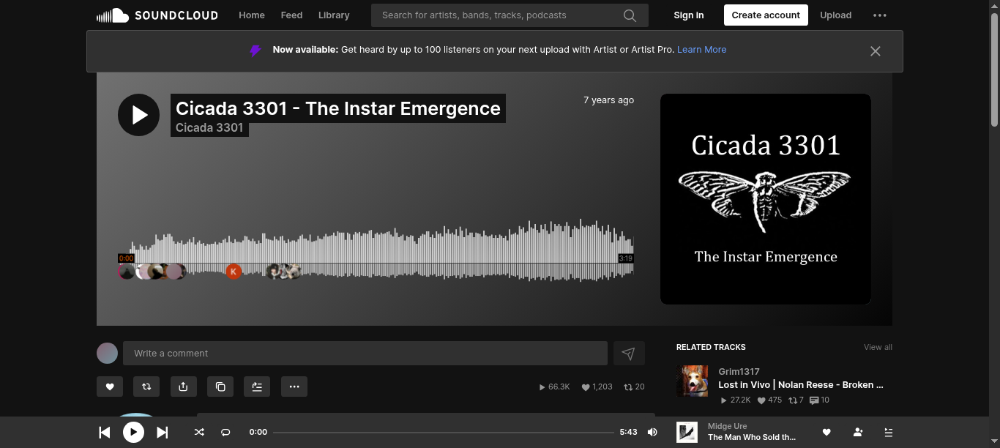
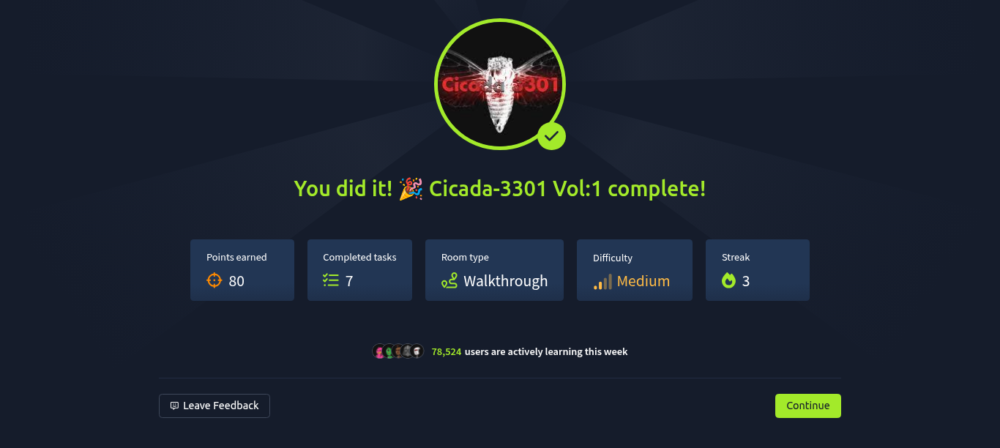

# Task 7: The Final Song

## Task Description
We have found the individuals we sought
-3301

## Objective
- Follow the final link discovered in Task 6
- Identify the song that concludes the Cicada 3301 Vol1 challenge
- Complete the journey through all seven tasks

## Question and Solution

### What is the song linked?

Following the final link from Task 6: `https://bit.ly/39pw2NH`

This link redirects to SoundCloud, revealing the concluding piece of the puzzle.

**Answer:** `the instar emergence`

## Challenge Completion

Congratulations! You have successfully completed the TryHackMe Cicada 3301 Vol1 challenge!

## Journey Summary

Through this magnificent challenge, we have navigated:

1. **Task 1:** Downloaded and extracted challenge files
2. **Task 2:** Analyzed audio spectrograms to find hidden QR codes
3. **Task 3:** Decoded multi-layered encryption (Base64 + Vigenère)
4. **Task 4:** Extracted steganographic data using steghide
5. **Task 5:** Applied OutGuess techniques from original Cicada challenges
6. **Task 6:** Cracked SHA-512 hashes and solved book cipher puzzles
7. **Task 7:** Reached the final destination - "the instar emergence"

## Skills Demonstrated

- **Audio Analysis** - Spectrogram examination and QR code extraction
- **Cryptography** - Base64, Vigenère cipher, hash cracking
- **Steganography** - Steghide and OutGuess data extraction
- **Classical Ciphers** - Book cipher with coordinate systems
- **Tool Proficiency** - Sonic Visualizer, steghide, outguess, hashid
- **Problem Solving** - Multi-layered puzzle solving and lateral thinking

## Technical Achievements

- Analyzed frequency-domain audio data
- Decoded layered encryption schemes
- Extracted hidden files from images
- Applied historical Cicada 3301 methodologies
- Solved complex book cipher with coordinate positioning
- Followed a complete cryptographic puzzle chain

## The Cicada 3301 Experience

This challenge brilliantly recreates the experience of the original Cicada 3301 internet mysteries, incorporating:
- Multiple steganographic techniques
- Classical and modern cryptographic methods
- Historical references and authentic tool usage
- Progressive difficulty and interconnected puzzles
- The signature mysterious and challenging nature of 3301

## Final Reflection

"the instar emergence" - a fitting title for the conclusion, as "instar" refers to the developmental stage of an insect between molts, symbolizing transformation and growth through the challenges faced.

## Task Status
✅ **COMPLETED** - The entire Cicada 3301 Vol1 challenge has been successfully solved!

**Final Answer:** `the instar emergence`

---
*Congratulations on completing this remarkable journey through cryptography, steganography, and puzzle-solving! You have proven yourself worthy of the 3301 designation.*
